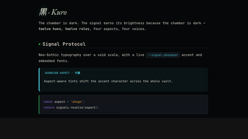

# Kuro

**Neo-Gothic · Post-Cyberpunk · CRT-Phosphor** — an Obsidian theme built around a
Twelve Signals palette, a Void Scale, and four switchable Aspects.

> The chamber is dark. The signal earns its brightness because the chamber is dark.
> Twelve hues, twelve roles. Four aspects, four voices.



## Features

- **Twelve Signals palette** (`--signal-*`): `crimson`, `phosphor`, `circuit`, `ember`,
  `ghost`, `biolink`, `neural-bleed`, `rust`, `spectre`, `toxic`, `voidwitch`, `pearl` —
  twelve hues mapped to twelve note roles, with RGB pairs for compositing.
- **Void Scale** (`--void-000` … `--void-900`) for chamber depth.
- **Four Aspects** — pick one globally in Style Settings, or set `<html data-aspect="…">` (per-note switching is available via the optional companion plugin):
  - **shugo** (守護) — the guardian
  - **gunshi** (軍師) — the strategist
  - **kantoku** (監督) — the director
  - **sensei** (先生) — the teacher
- **Color Vision Mode** — an orthogonal accessibility axis: saturation lift, red-green
  hue spread, and non-colour cues (per-aspect border patterns, per-signal glyphs).
- **Self-contained** — fonts are embedded; the theme makes no network requests.

## Install

### From the community catalogue

Settings → Appearance → Themes → Manage → browse for **Kuro**, install, and enable.

### Manual

Copy `theme.css` and `manifest.json` into `<your-vault>/.obsidian/themes/Kuro/`,
then enable under **Settings → Appearance → Themes**.

## Configuration

Kuro works out of the box with sensible defaults. For live configuration, install the
official **Style Settings** community plugin and open **Settings → Style Settings → Kuro**.
You get the aspect picker, signal presets, effects (scanlines, vignette, glow), typography,
reading, slides, editor/tabs, and the hanko watermark — all applied instantly. Style
Settings is optional; the theme is fully usable without it.

A separate companion plugin (in its own repo) adds *dynamic* behaviour Style Settings
cannot: per-note `aspect:` frontmatter switching and a status-bar aspect chip. It is
entirely optional.

## Build

`theme.css` is a generated monolith — do not edit it directly. The sources live in
`src/` as numbered fragments that `build.sh` concatenates lexically (`00`–`75`):

```sh
./src/build.sh   # regenerates theme.css from src/*.css
```

## Compatibility

- `minAppVersion: 1.5.0` — Obsidian 1.5 or newer.
- Optional companion plugins enhance the experience; the theme stands alone.

## Fonts

The theme embeds Latin subsets of four typefaces, all under the
[SIL Open Font License 1.1](https://openfontlicense.org/):

- **JetBrains Mono** — © JetBrains s.r.o.
- **Space Grotesk** — © Florian Karsten
- **Inter** — © The Inter Project Authors
- **EB Garamond** — © Georg Duffner & Octavio Pardo

## License

- **Code** (CSS, `build.sh`): [GNU AGPL-3.0](LICENSE).
- **Documentation** (README, CHANGELOG): [CC BY-SA 4.0](LICENSE-DOCS).
- **Embedded fonts**: SIL OFL 1.1 (see above).

See [LICENSING.md](LICENSING.md) for the rationale.
