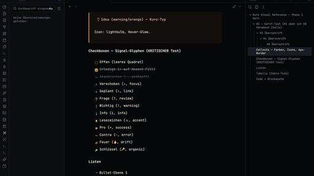

# Kuro

**Neo-Gothic · Post-Cyberpunk** — an Obsidian theme built as a skeleton-fork of
[Minimal](https://github.com/kepano/minimal), with a Twelve-Signals palette on a
both-mode Chamber (dark) / Paper (light) surface.

> The chamber is dark. The signal earns its brightness because the chamber is dark.



## What it is

Kuro 5.0 is a **skeleton-fork of Minimal** (kepano, MIT): it owns Minimal's variable/chrome
skeleton and edits it directly, then **replaces Minimal's components with its own** rather than
layering overrides on top — so there are no specificity fights and no upstream-update breakage.
Everything is plain CSS fragments assembled by a zero-dependency `build.sh`.

## Features

- **Chamber / Paper palette** — hand-tuned dark and light surfaces, both-mode by construction
  (every semantic role is defined in both modes, enforced by `check.sh`).
- **Signal roles** — twelve semantic signals mapped onto eight accents (`--role-*`), so every
  component reads a colour *by meaning*.
- **Signal-driven components** — callouts (a large typed library with icons + hover animations),
  task-checkbox glyphs (visible empty boxes, per-`[data-task]` glyphs), accent-tinted mono tag
  pills, framed code blocks, caps-header tables, a serif-italic blockquote aside, tinted list
  markers, and a role-keyed graph palette.
- **Typography** — JetBrains Mono body everywhere + EB Garamond italic for H1 and the inline title.
- **Accent follows your system colour** — Kuro uses the accent you pick in
  **Settings → Appearance → Accent color**, in both light and dark; no forced override.
- **Neurodivergence-friendly** — respects `prefers-reduced-motion`; a dark-only glow and film-grain
  that can be switched off.
- **Self-contained** — fonts are embedded as Latin-subset woff2; the theme makes no network requests.

## Install

### From the community catalogue

Settings → Appearance → Themes → Manage → browse for **Kuro**, install, and enable.

### Manual

Copy `theme.css` and `manifest.json` into `<your-vault>/.obsidian/themes/Kuro/`,
then enable under **Settings → Appearance → Themes**.

## Configuration

Kuro works out of the box. For live configuration, install the official **Style Settings**
community plugin and open **Settings → Style Settings → Kuro**:

- **Effects** — disable the signal glow, disable callout icon animations, choose a callout style
  (filled / subtle / border-only), toggle table zebra striping.
- **Shape & density** — corner rounding, note lift strength, card lift strength, code font size.

Style Settings is optional; the theme is fully usable without it.

## Build

`theme.css` is generated — do not edit it directly. Kuro's sources live in `src/` as numbered CSS
fragments: `*-minimal-*.css` are the owned Minimal skeleton, `*-kuro-*.css` are Kuro's own values
and components. `build.sh` concatenates the fragments and `check.sh` verifies the build
(determinism, both-mode palette parity, contrast, `!important` discipline, no-hex in components,
size, no remote imports).

```sh
./src/build.sh   # regenerates theme.css from src/*.css
./src/check.sh   # verifies the build
```

The anatomy of the theme — how each component is targeted, where Minimal's approach broke, and how
Kuro replaces it — is documented in [`docs/GUIDE.md`](docs/GUIDE.md). To fork Kuro or pull Minimal
upstream selectively, see [`docs/THEME-AUTHORING.md`](docs/THEME-AUTHORING.md).

## Compatibility

- `minAppVersion: 1.9.0` — Obsidian 1.9 or newer (Minimal's floor).

## Fonts

The theme embeds Latin subsets of two typefaces, both under the
[SIL Open Font License 1.1](https://openfontlicense.org/):

- **JetBrains Mono** — © JetBrains s.r.o.
- **EB Garamond** — © Georg Duffner & Octavio Pardo

## License

- **Code** (CSS, `build.sh`): [MIT](LICENSE) — a skeleton-fork of Minimal (© 2020–2024 Stephan Ango),
  released under Minimal's MIT license.
- **Documentation** (README, CHANGELOG, `docs/`): [CC BY-SA 4.0](LICENSE-DOCS).
- **Embedded fonts**: SIL OFL 1.1 (see above).

See [LICENSING.md](LICENSING.md) for the rationale.
